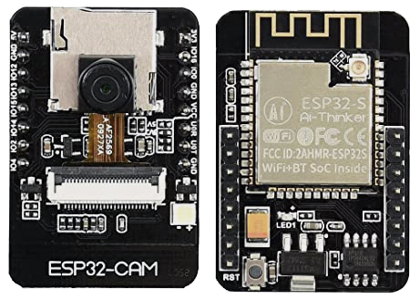

# ESP32CAM-RTSP

[](https://github.com/rzeldent/esp32cam-rtsp/actions/workflows/main.yml)

Simple [RTSP](https://en.wikipedia.org/wiki/Real_Time_Streaming_Protocol) server.
Easy configuration through the web interface.

Flashing this software on a ESP32CAM module will make it a **RTSP streaming camera** server.
The RTSP protocol is an industry standard and allows many CCTV systems and applications (like for example [VLC](https://www.videolan.org/vlc/)) to connect directly to the ESP32CAM camera stream.
It is also possible to to stream directly to a server using [ffmpeg](https://ffmpeg.org).
This makes the module a camera server allowing recording and the stream can be stored on a disk and replayed later.

This software supports the following ESP32-CAM (and alike) modules:

- ESP32CAM
- AI THINKER
- TTGO T-CAM
- WROVER-KIT
- M5STACK



This software provides a **configuration web server**, that can be used to:

- Provide information about the state of the device, wifi connection and camera,
- Set the WiFi parameters,
- Set the timeout for connecting to the access point,
- Set an access password,
- Select the board type,
- Select the image size,
- Select the frame rate,
- Select number of frame buffers
- Select the JPEG quality

The software provides contains also a mDNS server to be easily discoverable on the local network.
It advertises HTTP (port 80) and RTSP (port 554)

## Required

- ESP32-CAM module or similar,
- USB to Serial (TTL level) converter, piggyback board ESP32-CAM-MB or other way to connect to the device,
- [**PlatformIO**](https://platformio.org/) software (free download)

## Installing and running PlatformIO

PlatformIO is available for all major operating systems: Windows, Linux and MacOS. It is also provided as a plugin to [Visual Studio Code](https://visualstudio.microsoft.com).
More information can be found at: [https://docs.platformio.org/en/latest/installation.html](https://docs.platformio.org/en/latest/installation.html) below the basics.

### Debian based systems command-line install

Install platformIO

```sh
 sudo apt-get install python-pip
 sudo pip install platformio
 pio upgrade
```

### Windows, Linux and MacOS

Install [**Visual Studio code**](https://code.visualstudio.com) and install the PlatformIO plugin.
For command line usage Python and PlatformIO-Core is sufficient.

## Putting the ESP32-CAM in download mode

### ESP32-CAM-MB

When using the ESP32-CAM-MB board, press and hold the GP0 button on the ESP32-CAM-MB board.
Then press short the reset button (on the inside) on the ESP32-CAM board and release the GP0 button.
This will put the ESP32-CAM board in download mode.

### FTDI adapter

When using an FTDI adapter, make sure the adapter is set to 3.3 volt before connecting. Use the wiring schema below.


After programming remove the wire to tge GPIO0 pin to exit the download mode.

## Compiling and deploying the software

Open a command line or terminal window and clone this repository from GitHub.

```sh
git clone https://github.com/rzeldent/esp32cam-rtsp.git
```

go into the folder

```sh
cd esp32cam-rtsp
```

Next, the firmware has to be build and deployed to the ESP32.
There are to flavours to do this; using the command line or the graphical interface of Visual Studio Code.
I recommend to use VIsual Studio Code as it is free to use and offers more insight.

### Using the command line

First the source code has to be compiled. Type:

```sh
pio run
```

When finished, firmware has to be uploaded.
Make sure the ESP32-CAM is in download mode (see previous section) and type:

```sh
 pio run -t upload
```

When done remove the jumper when using a FTDI adapter or press the reset button on the ESP32-CAM.
To monitor the output, start a terminal using:

```sh
 pio device monitor
```

### Using Visual studio

Open the project in a new window. Run the following tasks using the ```Terminal -> Run Task``` or CTRL+ALT+T command in the menu (or use the icons below on the toolbar). Make sure the ESP32-CAM is in download mode during the uploads.

- PlatformIO: Build (esp32cam)
- PlatformIO: Upload (esp32cam)

To monitor the behavior run the task, run: ```PlatformIO: Monitor (esp32cam)```

## Setting up the ESP32CAM-RTSP

After the programming of the ESP32, there is no configuration present. This needs to be added.
To connect initially to the device open the WiFi connections and select the WiFi network / access point called **ESP32CAM-RTSP**.
Initially there is no password present.

After connecting, the browser should automatically open the status page.
In case this does not happens automatically, connect to [http://192.168.4.1](http://192.168.4.1).
This page will display the current settings and status. On the bottom, there is a link to the config. Click on this link.

This link brings up the configuration screen when connecting fot the first time.


Configure at least:

- The access point to connect to. No dropdown is present to show available networks!
- A password for accessing the Access point (AP) when starting. (required)
- Type of the ESP32-CAM board

When finished press ```Apply``` to save the configuration. The screen will redirect to the status screen.
Here it is possible to reboot the device so the settings take effect.
It is also possible to restart manually by pressing the reset button.

## Connecting to the configuration

After the initial configuration and the device is connected to an access point, the device can be configured over http.

When a connection is made to [http://esp32cam-rtsp](http://esp32cam-rtsp) the status screen is shown.


In case changes have been made to the configuration, this is shown and the possibility to restart is given.

Clicking on the ```change configuration``` button will open the configuration. It is possible that a password dialog is shown before entering.
If this happens, for the user enter 'admin' and for the password the value that has been configured as the Access Point password.

## Connecting to the RTSP stream

RTSP stream is available at: [rtsp://esp32cam-rtsp.local:554/mjpeg/1](rtsp://esp32cam-rtsp.local:554/mjpeg/1).
This link can be opened with for example [VLC](https://www.videolan.org/vlc/).

:warning: **Please be aware that there is no password present on the stream!**

## Issues / Nice to know

- The red LED on the back of the device indicates the device is not connected.
- Sometimes after configuration a reboot is required.
  If the error screen is shown that it is unable to make a connection, first try to reboot the device,
- When booting, the device waits 30 seconds for a connection (configurable).
  You can make a connection to the SSID and log in using the credentials below,
- When connected, go to the ip of the device and, when prompted for the credentials, enter 'admin' and the AP password.
  This is a **required** field before saving the credentials,
- When the password is lost, a fix is to completely erase the ESP32 using the ```pio run -t erase``` command.
  This will reset the device including configuration.
  If using the esptool, you can do this using ```esptool.py --chip esp32 --port /dev/ttyUSB0 erase_flash```.
  However, after erasing, re-flashing of the firmware is required.
- When finished configuring for the first time and the access point is entered, disconnect from the wireless network provided by the device.
  This should reset the device and connect to the access point.
  Resetting is also a good alternative...

### Power

Make sure the power is 5 volts and stable, although the ESP32 is a 3.3V module, this voltage is created on the board.
If not stable, it has been reported that restarts occur when starting up (probably when power is required for WiFi).
The software disables the brown out protection so there is some margin in the voltage.

### PSRAM

Some esp32cam modules have additional ram on the board. This allows to use this ram as frame buffer.
Detecting and using this special RAM is handled automatically.
The availability of PSRAM can be seen in the HTML status overview.

### Camera modules

Be careful when connecting the camera module.
Make sure it is connected the right way around (Camera pointing away from the board) and the ribbon cable inserted to the end before locking it.

## Credits

esp32cam-ready depends on PlatformIO, Bootstrap5 and Micro-RTSP by Kevin Hester.
