# ESP32CAM-RTSP

[](https://github.com/rzeldent/esp32cam-rtsp/actions/workflows/main.yml)

Simple [RTSP](https://en.wikipedia.org/wiki/Real_Time_Streaming_Protocol), [HTTP JPEG Streamer](https://en.wikipedia.org/wiki/Motion_JPEG) and image server with configuration through the web interface.

> [!IMPORTANT]  
> New branch available! Here [branch: develop](https://github.com/rzeldent/esp32cam-rtsp/tree/develop)
> This branch supports all the current devices and the Seeed Studio Xiao esp32s3!
> Please use this and let me know if this works for you!

Flashing this software on a ESP32CAM module will make it a **RTSP streaming camera** server, a **HTTP Motion JPEG streamer** and a **HTTP image server**.

Supported protocols

- RTSP
  The RTSP protocol is an industry standard and allows many CCTV systems and applications (like for example [VLC](https://www.videolan.org/vlc/)) to connect directly to the ESP32CAM camera stream.
  It is also possible to stream directly to a server using [ffmpeg](https://ffmpeg.org).
  This makes the module a camera server allowing recording and the stream can be stored on a disk and replayed later.
  The URL is rtsp://&lt;ip address&gt;:554/mjpeg/1

- HTTP Motion JPEG
  The HTTP JPEG streamer makes it possible to watch the camera stream directly in your browser.
  The URL is http://&lt;ip address&gt;/stream

- HTTP image
  The HTTP Image returns an HTTP JPEG image of the camera.
  The URL is http://&lt;ip address&gt;/snapshot

This software supports the following ESP32-CAM (and alike) modules:

- AI THINKER
- EspressIf ESP-EYE
- EspressIf ESP32S2-CAM
- EspressIf ESP32S3-CAM-LCD
- EspressIf ESP32S3-EYE
- Freenove WROVER KIT
- M5STACK ESP32CAM
- M5STACK_PSRAM
- M5STACK_UNITCAM
- M5STACK_UNITCAMS3
- M5STACK_V2_PSRAM
- M5STACK_PSRAM
- M5STACK_WIDE
- M5STACK
- Seeed Studio XIAO ESP32S3 SENSE
- TTGO T-CAMERA
- TTGO T-JOURNAL

The software provides a **configuration web server**, that can be used to:

- Provide information about the state of the device, wifi connection and camera,
- Set the WiFi parameters,
- Set the timeout for connecting to the access point,
- Set an access password,
- Select the image size,
- Select the frame rate,
- Select the JPEG quality
- Enable the use of the PSRAM
- Set the number of frame buffers
- Configure the camera options:
  - Brightness
  - Contrast
  - Saturation
  - Special effect (Normal, Negative, Gray-scale, Red/Green/Blue tint, Sepia)
  - White balance
  - Automatic White Balance gain
  - Wite Balance mode
  - Exposure control
  - Auto Exposure (dsp)
  - Auto Exposure level
  - Manual exposure value
  - Gain control
  - Manual gain control
  - Auto gain ceiling
  - Black pixel correction
  - White pixel correction
  - Gamma correction
  - Lens correction
  - Horizontal mirror
  - Vertical flip
  - Downside enable
  - Color bar

The software provides contains also a mDNS server to be easily discoverable on the local network.
It advertises HTTP (port 80) and RTSP (port 554)

## Required

- ESP32-CAM module or similar,
- USB to Serial (TTL level) converter, piggyback board ESP32-CAM-MB or other way to connect to the device,
- [**PlatformIO**](https://platformio.org/) software (free download)

## Boards

There are a lot of boards available that are all called ESP32-CAM.
However, there are differences in CPU (type/speed/cores), how the camera is connected, presence of PSRAM or not...
To select the right board use the table below and use the configuration that is listed below for your board:

| Board                           | Image                                                                                               | CPU                     | SRAM   | Flash  | PSRAM | Camera          |             | Site                                                                                                                              |
|---                              |---                                                                                                  |---                      |---     |---     | ---   |---              |---          |---                                                                                                                                |
| Espressif ESP32-Wrover CAM      | 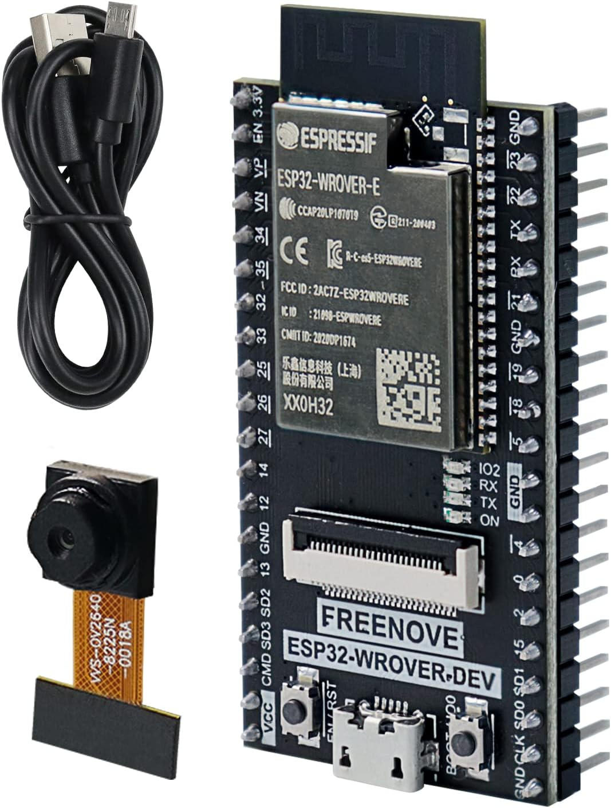                                                          | ESP32                   | 520KB  | 4Mb    | 4MB   | OV2640          |             |                                                                                                                                   |
| AI-Thinker ESP32-CAM            | 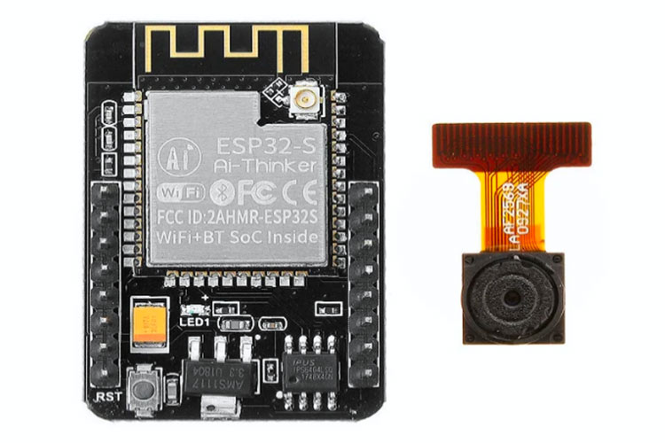 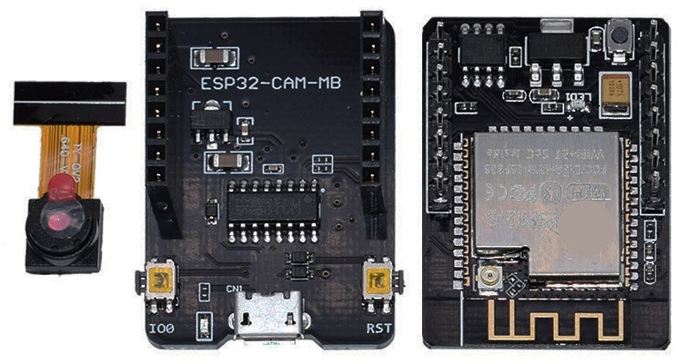  | ESP32-S                 | 520KB  | 4Mb    | 4MB   | OV2640          |             | [https://docs.ai-thinker.com/esp32-cam](https://docs.ai-thinker.com/esp32-cam)                                                    |
| Espressif ESP-EYE               | 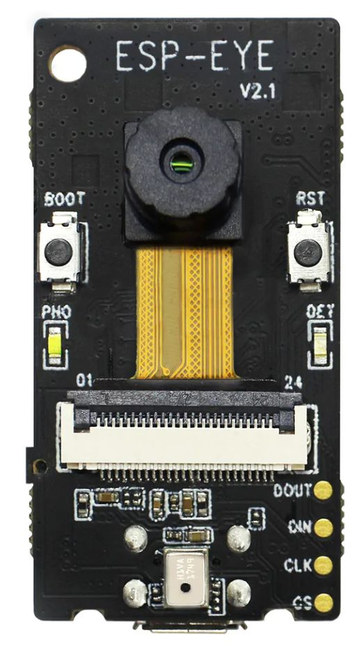                                                         | ESP32                   | 520KB  | 4Mb    | 4MB   | OV2640          |             |                                                                                                                                   |
| Espressif ESP-S3-EYE            | 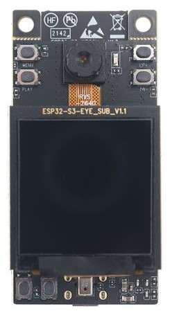                                                       | ESP32-S3                | 520KB  | 4Mb    | 4MB   | OV2640          |             | [https://www.espressif.com/en/products/devkits/esp-eye/overview](https://www.espressif.com/en/products/devkits/esp-eye/overview)  |
| LilyGo camera module            | 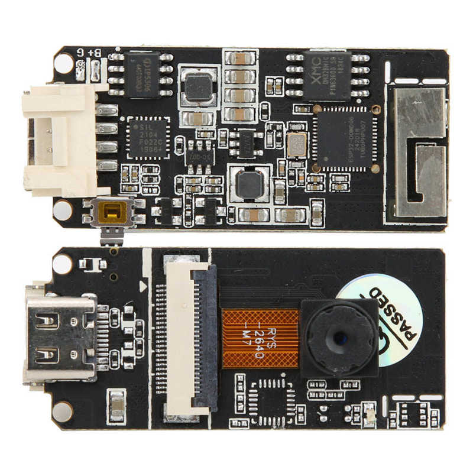                                                      | ESP32 Wrover            | 520KB  | 4Mb    | 4MB   | OV2640 / OV5640 |             |                                                                                                                                   |
| LilyGo Simcam                   | 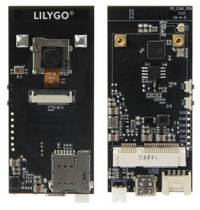                                                             |                         |        |        |       | OV2640          |             |                                                                                                                                   |
| LilyGo TTGO-T Camera            | 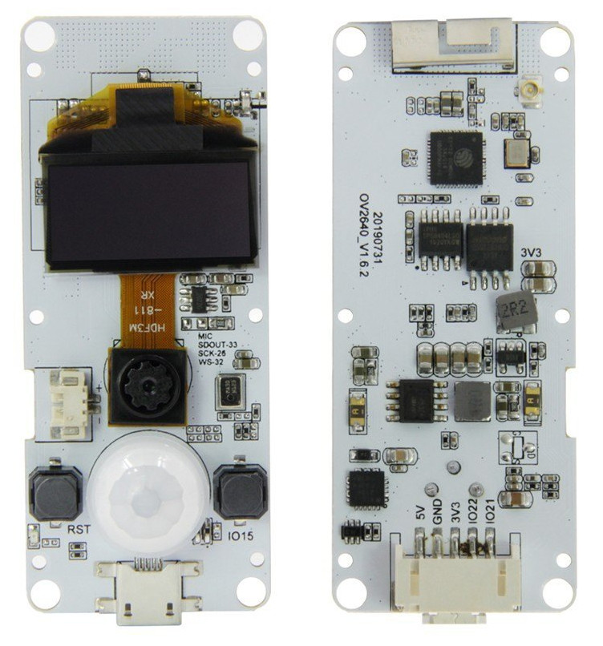                                                      |                         |        |        |       | OV2640          |             |                                                                                                                                   |
| M5Stack ESP32CAM                |                                                       | ESP32                   | 520Kb  | 4Mb    | -     | OV2640          | Microphone  | [https://docs.m5stack.com/en/unit/esp32cam](https://docs.m5stack.com/en/unit/esp32cam)                                            |
| M5Stack UnitCam                 | 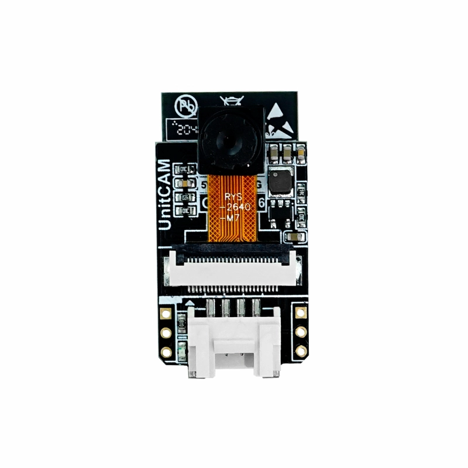 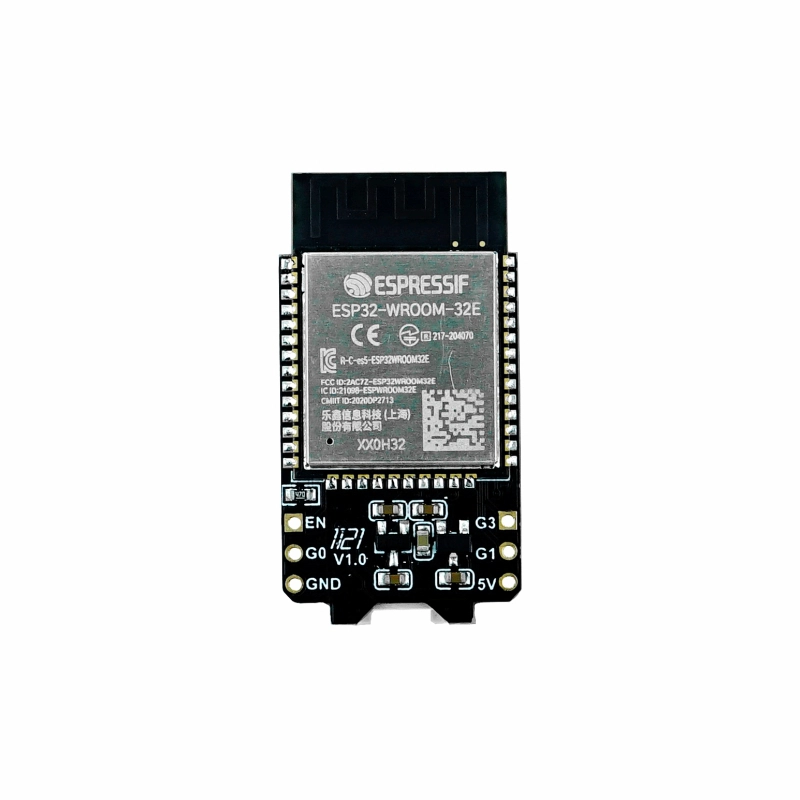       | ESP32-WROOM-32E         | 520KB  | 4Mb    | -     | OV2640          |             | [https://docs.m5stack.com/en/unit/unit_cam](https://docs.m5stack.com/en/unit/unit_cam)                                            |
| M5Stack Camera                  | 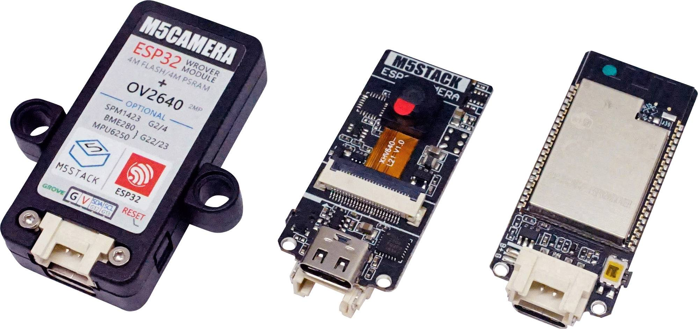                                                      | ESP32                   | 520Kb  | 4Mb    | -     | OV2640          |             | [https://docs.m5stack.com/en/unit/m5camera](https://docs.m5stack.com/en/unit/m5camera)                                            |
| M5Stack Camera PSRAM            |                                                       | ESP32                   | 520Kb  | 4Mb    | 4Mb   | OV2640          |             | [https://docs.m5stack.com/en/unit/m5camera](https://docs.m5stack.com/en/unit/m5camera)                                            |
| M5Stack UnitCamS3               | 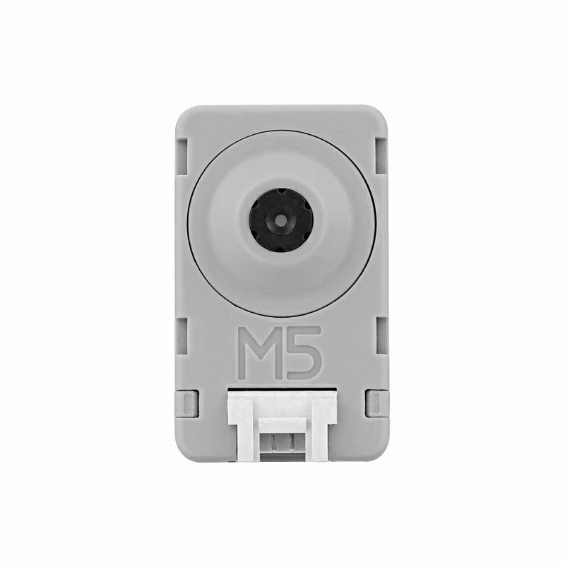 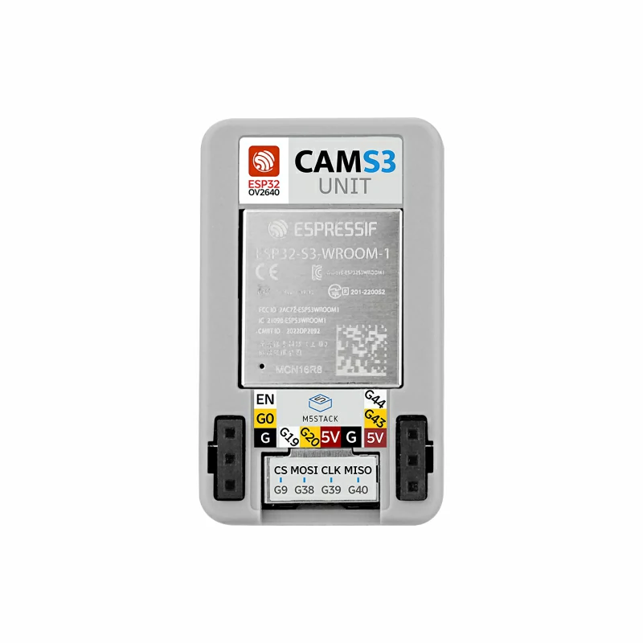         | ESP32-S3-WROOM-1-N16R8  | 520Kb  | 16Mb   | 8Mb   | OV2640          |             | [https://docs.m5stack.com/en/unit/Unit-CamS3](https://docs.m5stack.com/en/unit/Unit-CamS3)                                        |
| Seeed studio Xiao ESP32S3 Sense | 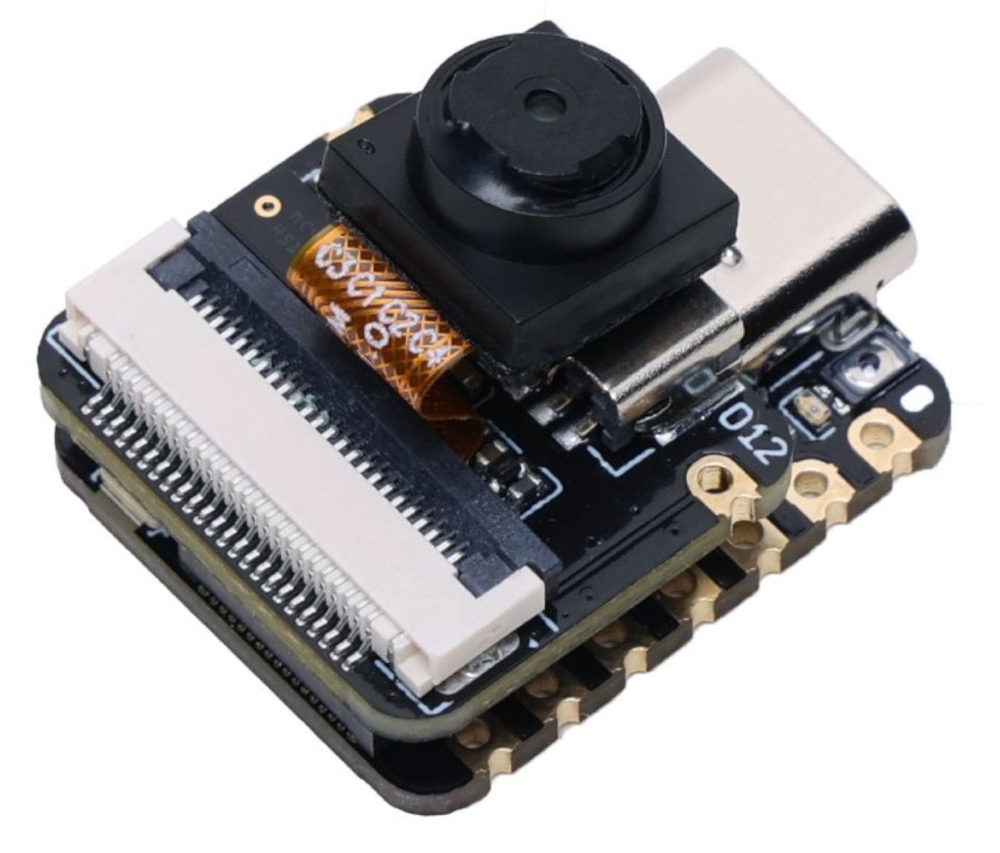                                           | ESP32-S3R8              | 520KB  | 8Mb    | 8MB   | OV2640          | Microphone  | [https://www.seeedstudio.com/XIAO-ESP32S3-Sense-p-5639.html](https://www.seeedstudio.com/XIAO-ESP32S3-Sense-p-5639.html)          |

## Installing and running PlatformIO

PlatformIO is available for all major operating systems: Windows, Linux and MacOS. It is also provided as a plugin to [Visual Studio Code](https://visualstudio.microsoft.com).
More information can be found at: [https://docs.platformio.org/en/latest/installation.html](https://docs.platformio.org/en/latest/installation.html) below the basics.

Install [Visual Studio Code](https://code.visualstudio.com) and install the PlatformIO plugin.

## Putting the ESP32-CAM in download mode

### ESP32-CAM-MB

When using the ESP32-CAM-MB board, press and hold the GP0 button on the ESP32-CAM-MB board.
Then press short the reset button (on the inside) on the ESP32-CAM board and release the GP0 button.
This will put the ESP32-CAM board in download mode.

### FTDI adapter

When using an FTDI adapter, make sure the adapter is set to 3.3 volt before connecting. Use the wiring schema below.

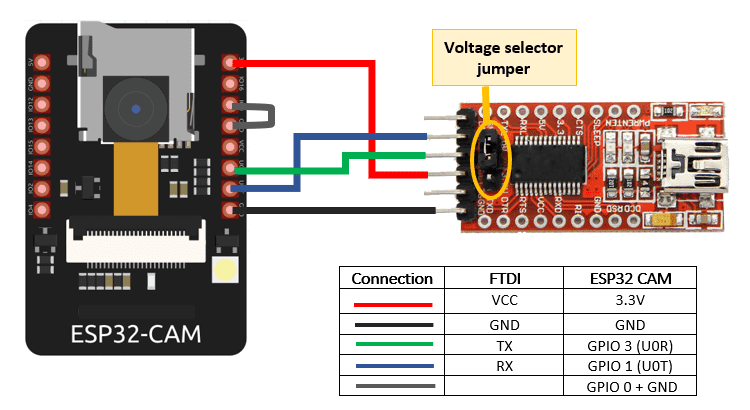

After programming remove the wire to tge GPIO0 pin to exit the download mode.

## Compiling and deploying the software

Open a command line or terminal window and clone this repository from GitHub.

```sh
git clone https://github.com/rzeldent/esp32cam-rtsp.git
```

go into the folder

```sh
cd esp32cam-rtsp
```

Next, the firmware has to be build and deployed to the ESP32.
There are to flavours to do this; using the command line or the graphical interface of Visual Studio Code.

### Using the command line

Make sure you have the latest version of the Espressif toolchain.

```sh
pio pkg update -g -p espressif32
```

First the source code has to be compiled to build all targets

```sh
pio run
```

if only a specific target is required, for example the ```esp32cam_ttgo_t_journal``` type:

```sh
pio run -e esp32cam_ttgo_t_journal
```

When finished, firmware has to be uploaded.
Make sure the ESP32-CAM is in download mode (see previous section) and type:

```sh
 pio run -t upload
```

or, again, for a specific target, for example ```esp32cam_ai_thinker```

```sh
pio run -t upload -e esp32cam_ai_thinker
```

When done remove the jumper when using a FTDI adapter or press the reset button on the ESP32-CAM.
To monitor the output, start a terminal using:

```sh
 pio device monitor
```

### Using Visual studio

Open the project in a new window. Run the following tasks using the ```Terminal -> Run Task``` or CTRL+ALT+T command in the menu (or use the icons below on the toolbar). Make sure the ESP32-CAM is in download mode during the uploads.

- PlatformIO: Build (esp32cam)
- PlatformIO: Upload (esp32cam)

To monitor the behavior run the task, run: ```PlatformIO: Monitor (esp32cam)```

## Setting up the ESP32CAM-RTSP

After the programming of the ESP32, there is no configuration present. This needs to be added.
To connect initially to the device open the WiFi connections and select the WiFi network / access point called **ESP32CAM-RTSP**.
Initially there is no password present.

After connecting, the browser should automatically open the status page.
In case this does not happens automatically, connect to [http://192.168.4.1](http://192.168.4.1).
This page will display the current settings and status. On the bottom, there is a link to the config. Click on this link.

This link brings up the configuration screen when connecting fot the first time.

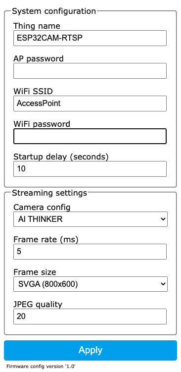

Configure at least:

- The access point to connect to. No dropdown is present to show available networks!
- A password for accessing the Access point (AP) when starting. (required)
- Type of the ESP32-CAM board

When finished press ```Apply``` to save the configuration. The screen will redirect to the status screen.
Here it is possible to reboot the device so the settings take effect.
It is also possible to restart manually by pressing the reset button.

## Connecting to the configuration

After the initial configuration and the device is connected to an access point, the device can be configured over http.

When a connection is made to [http://esp32cam-rtsp](http://esp32cam-rtsp) the status screen is shown.

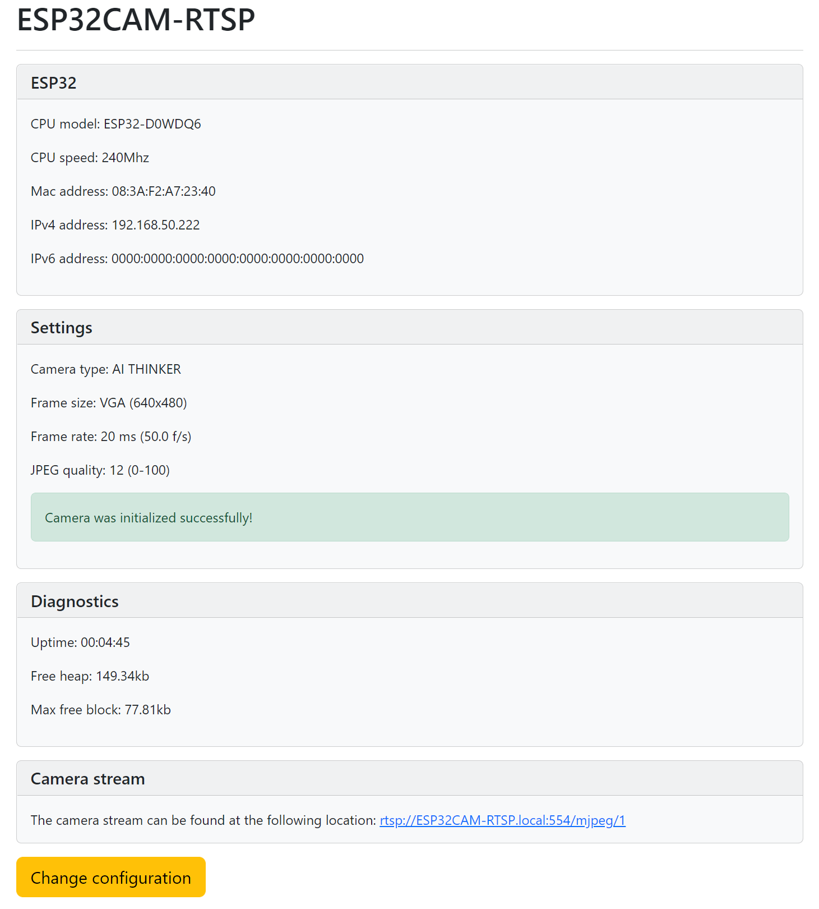

In case changes have been made to the configuration, this is shown and the possibility to restart is given.

Clicking on the ```change configuration``` button will open the configuration. It is possible that a password dialog is shown before entering.
If this happens, for the user enter 'admin' and for the password the value that has been configured as the Access Point password.

## Connecting to the RTSP stream

RTSP stream is available at: [rtsp://esp32cam-rtsp.local:554/mjpeg/1](rtsp://esp32cam-rtsp.local:554/mjpeg/1).
This link can be opened with for example [VLC](https://www.videolan.org/vlc/).

## Connecting to the JPEG motion server

The JPEG motion server server is available using a normal web browser at: [http://esp32cam-rtsp.local:/stream](http://esp32cam-rtsp.local/stream).

## Connecting to the image server

The image server server is available using a normal web browser at: [http://esp32cam-rtsp.local:/snapshot](http://esp32cam-rtsp.local/snapshot).

:bangbang: **Please be aware that there is no password present!**.
Everybody with network access to the device can see the streams or images! Beware of :trollface:!

## API

There is a minimum API present to perform some tasks using HTTP requests. For some requests authentication is required.
The authentication used is basic authentication. The user is always admin and the password the access point key.\
If using a browser, remember that the authentication is stored in the browser session so needs to be entered only once.

The URLs are below:

### GET: /restart

Calling this URL will restart the device. Authentication is required.

### GET: /config

Calling this URL will start the form for configuring the device in the browser. Authentication is required.

### GET: /snapshot

Calling this URL will return a JPEG snapshot of the camera in the browser.
This request can also be used (for example using cURL) to save the snapshot to a file.

## Issues / Nice to know

- The red LED on the back of the device indicates the device is not connected.
- Sometimes after configuration a reboot is required.
  If the error screen is shown that it is unable to make a connection, first try to reboot the device,
- When booting, the device waits 30 seconds for a connection (configurable).
  You can make a connection to the SSID and log in using the credentials below,
- When connected, go to the ip of the device and, when prompted for the credentials, enter 'admin' and the AP password.
  This is a **required** field before saving the credentials,
- When the password is lost, a fix is to completely erase the ESP32 using the ```pio run -t erase``` command.
  This will reset the device including configuration.
  If using the esptool, you can do this using ```esptool.py --chip esp32 --port /dev/ttyUSB0 erase_flash```.
  However, after erasing, re-flashing of the firmware is required.
- When finished configuring for the first time and the access point is entered, disconnect from the wireless network provided by the device.
  This should reset the device and connect to the access point.
  Resetting is also a good alternative...
- There are modules that have no or faulty PSRAM (despite advertised as such).
  This can be the case if the camera fails to initialize.
  It might help to disable the use of the PSRAM and reduce the buffers and the screen size.

### Power

Make sure the power is 5 volts and stable, although the ESP32 is a 3.3V module, this voltage is created on the board.
If not stable, it has been reported that restarts occur when starting up (probably when power is required for WiFi).
The software disables the brown out protection so there is some margin in the voltage.
Some people suggest to add a capacitor over the 5V input to stabilize the voltage.

### PSRAM / Buffers / JPEG quality

Some esp32cam modules have additional ram on the board. This allows to use this ram as frame buffer.
The availability of PSRAM can be seen in the HTML status overview.

Not all the boards are equipped with PSRAM:

|  Board            | PSRAM           |
|---                |---              |
| WROVER_KIT        | 8Mb             |
| ESP_EYE           | 8Mb             |
| ESP32S3_EYE       | 8Mb             |
| M5STACK_PSRAM     | 8Mb             |
| M5STACK_V2_PSRAM  | Version B only  |
| M5STACK_WIDE      | 8Mb             |
| M5STACK_ESP32CAM  | No              |
| M5STACK_UNITCAM   | No              |
| M5STACK_UNITCAMS3 | 8Mb             |
| AI_THINKER        | 8Mb             |
| TTGO_T_JOURNAL    | No              |
| ESP32_CAM_BOARD   | ?               |
| ESP32S2_CAM_BOARD | ?               |
| ESP32S3_CAM_LCD   | ?               |

Depending on the image resolution, framerate and quality, the PSRAM must be enabled and/or the number of frame buffers increased to keep up with the data generated by the sensor.
There are (a lot of?) boards around with faulty PSRAM. If the camera fails to initialize, this might be a reason. See on [Reddit](https://www.reddit.com/r/esp32/comments/z2hyns/i_have_a_faulty_psram_on_my_esp32cam_what_should/).
In this case disable the use of PSRAM in the configuration and do not use camera modes that require PSRAM,

For the setting JPEG quality, a lower number means higher quality.
Be aware that a very high quality (low number) can cause the ESP32 cam to crash or return no image.

The default settings are:

- No PSRAM
  - SVGA (800x600)
  - 1 frame buffer
  - JPEG quality 12

- With PSRAM
  - UXGA (1600x1200)
  - 2 frame buffers
  - JPEG quality 10

### Camera module

Be careful when connecting the camera module.
Make sure it is connected the right way around (Camera pointing away from the board) and the ribbon cable inserted to the end before locking it.

## Credits

esp32cam-rtsp depends on PlatformIO, Bootstrap 5 and Micro-RTSP by Kevin Hester.

## Change history

- January 2024
  - Moved settings to board definitions
  - Added new boards
  - Removed OTA to increase performance
- Oktober 2023
  - Added support for Seeed Xiao esp32s3
  - New build system
  - Updated documentation
- March 2023
  - Added options to set PSRAM / Frame buffers
  - Added JPEG Motion streaming
- Feb 2023
  - Added additional settings for camera configuration
- Nov 2022
  - Added OTA
  - Fix for grabbing frame
  - Fixed bug: Increased WiFi password length
- Sep 2022
  - Added GUI with bootstrap
  - More information in web page
  - Added camera preview in HTML
- Jul 2022
  - Initial version
