# ESP32CAM-RTSP

[](https://github.com/rzeldent/esp32cam-rtsp/actions/workflows/main.yml)


Simple [RTSP](https://en.wikipedia.org/wiki/Real_Time_Streaming_Protocol), [HTTP JPEG Streamer](https://en.wikipedia.org/wiki/Motion_JPEG) and image server with configuration through the web interface.

> [!NOTE]
> A [`develop`](https://github.com/rzeldent/esp32cam-rtsp/tree/develop) branch is available with the newest boards (including the Seeed Studio XIAO ESP32S3). It may be ahead of `main`; feedback and testing are welcome.

Flashing this software on a ESP32CAM module will make it a **RTSP streaming camera** server, a **HTTP Motion JPEG streamer** and a **HTTP image server**.

## Contents

- [Features](#features)
- [Supported boards](#boards)
- [Installing and running PlatformIO](#installing-and-running-platformio)
- [Putting the ESP32-CAM in download mode](#putting-the-esp32-cam-in-download-mode)
- [Compiling and deploying the software](#compiling-and-deploying-the-software)
- [Setting up the ESP32CAM-RTSP](#setting-up-the-esp32cam-rtsp)
- [Connecting to the configuration](#connecting-to-the-configuration)
- [Connecting to the RTSP stream](#connecting-to-the-rtsp-stream)
- [RTSP authentication](#rtsp-authentication)
- [Connecting to the JPEG motion server](#connecting-to-the-jpeg-motion-server)
- [Connecting to the image server](#connecting-to-the-image-server)
- [API](#api)
- [Issues / Nice to know](#issues--nice-to-know)
- [Credits](#credits)

## Features

Supported protocols

- RTSP
  The RTSP protocol is an industry standard and allows many CCTV systems and applications (like for example [VLC](https://www.videolan.org/vlc/)) to connect directly to the ESP32CAM camera stream.
  It is also possible to stream directly to a server using [ffmpeg](https://ffmpeg.org).
  This makes the module a camera server allowing recording and the stream can be stored on a disk and replayed later.
  The video is encoded as Motion-JPEG (RTP payload 26) and streamed over RTP/UDP (default) or RTP/RTSP/TCP.
  Boards with an onboard microphone (e.g. the Seeed Studio XIAO ESP32S3 SENSE) can additionally stream
  G.711 a-law audio (RTP payload 8).
  The URL is rtsp://&lt;ip address&gt;:554/mjpeg/1
  Authentication is optional; when enabled, clients must provide credentials
  (see [RTSP authentication](#rtsp-authentication)).

- HTTP Motion JPEG
  The HTTP JPEG streamer makes it possible to watch the camera stream directly in your browser.
  The URL is http://&lt;ip address&gt;/stream

- HTTP image
  The HTTP Image returns an HTTP JPEG image of the camera.
  The URL is http://&lt;ip address&gt;/snapshot

This software supports the following ESP32-CAM (and alike) modules:

- AI THINKER
- Espressif ESP-EYE
- Espressif ESP32S2-CAM
- Espressif ESP32S3-CAM-LCD
- Espressif ESP32S3-EYE
- Freenove WROVER KIT
- M5STACK ESP32CAM
- M5STACK_PSRAM
- M5STACK_UNITCAM
- M5STACK_UNITCAMS3
- M5STACK_V2_PSRAM
- M5STACK_WIDE
- M5STACK M5PoECAM-W
- M5STACK Timer CAM (Original and X)
- Seeed Studio XIAO ESP32S3 SENSE
- TTGO T-CAMERA
- TTGO T-JOURNAL

The software provides a **configuration web server** that can be used to:

- Provide information about the state of the device, WiFi connection and camera,
- Set the WiFi parameters,
- Set the timeout for connecting to the access point,
- Set an access password,
- Select the image size,
- Select the frame rate,
- Select the JPEG quality,
- Enable the use of the PSRAM,
- Set the number of frame buffers,
- Configure the camera options:
  - Brightness
  - Contrast
  - Saturation
  - Special effect (Normal, Negative, Gray-scale, Red/Green/Blue tint, Sepia)
  - White balance
  - Automatic White Balance gain
  - White Balance mode
  - White Balance mode
  - Exposure control
  - Auto Exposure (dsp)
  - Auto Exposure level
  - Manual exposure value
  - Gain control
  - Manual gain control
  - Auto gain ceiling
  - Black pixel correction
  - White pixel correction
  - Gamma correction
  - Lens correction
  - Horizontal mirror
  - Vertical flip
  - Downsize enable
  - Color bar

The software also provides a mDNS server to be easily discoverable on the local network.
It advertises HTTP (port 80) and RTSP (port 554).

## Required

- ESP32-CAM module or similar,
- USB to Serial (TTL level) converter, piggyback board ESP32-CAM-MB or other way to connect to the device,
- [**PlatformIO**](https://platformio.org/) software (free download)

## Boards

There are a lot of boards available that are all called ESP32-CAM.
However, there are differences in CPU (type/speed/cores), how the camera is connected, presence of PSRAM or not...
To select the right board use the table below and use the configuration that is listed below for your board:

| Board                           | Image                                                                                               | CPU                     | SRAM   | Flash  | PSRAM | Camera          | Extras      | Manufacturer site                                                                                                                 |
|---                              |---                                                                                                  |---                      |---     |---     | ---   |---              |---          |---                                                                                                                                |
| Espressif ESP32-Wrover CAM      | 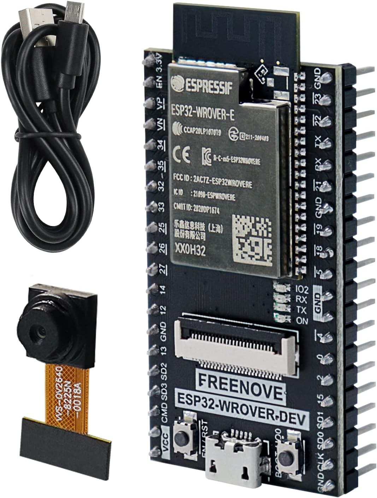                                                          | ESP32                   | 520KB  | 4MB    | 8MB   | OV2640          |             |                                                                                                                                   |
| AI-Thinker ESP32-CAM            | 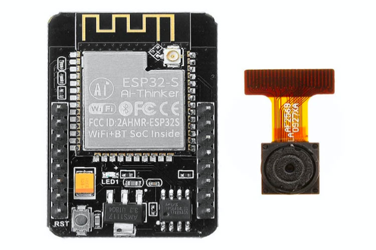 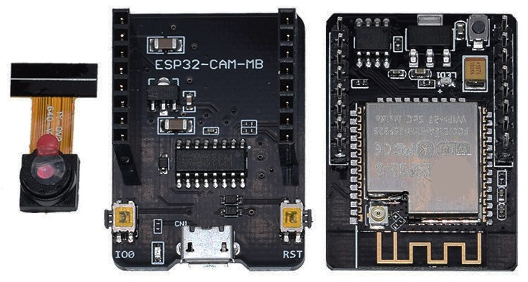  | ESP32                   | 520KB  | 4MB    | 4MB   | OV2640          |             | [https://docs.ai-thinker.com/esp32-cam](https://docs.ai-thinker.com/esp32-cam)                                                    |
| Espressif ESP-EYE               | 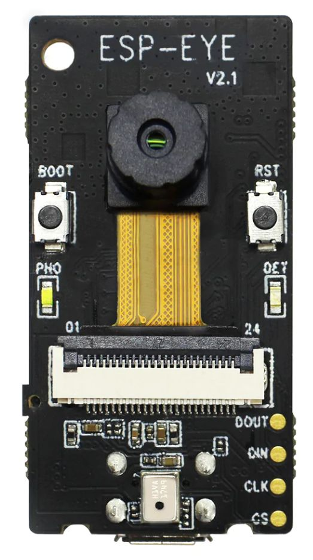                                                         | ESP32                   | 520KB  | 4MB    | 8MB   | OV2640          |             |                                                                                                                                   |
| Espressif ESP32-S3-EYE          | 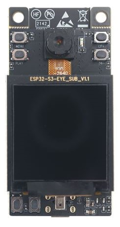                                                       | ESP32-S3                | 520KB  | 4MB    | 8MB   | OV2640          |             | [https://www.espressif.com/en/products/devkits/esp-eye/overview](https://www.espressif.com/en/products/devkits/esp-eye/overview)  |
| LilyGo camera module            | 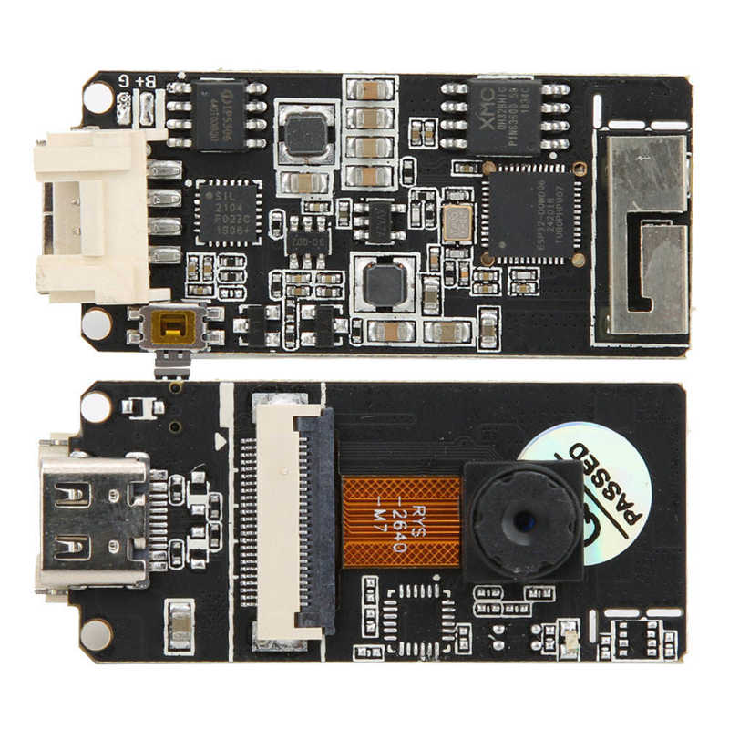                                                      | ESP32 Wrover            | 520KB  | 4MB    | 8MB   | OV2640 / OV5640 |             |                                                                                                                                   |
| LilyGo Simcam                   | 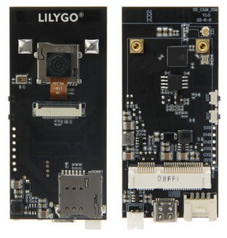                                                             |                         |        |        |       | OV2640          |             |                                                                                                                                   |
| LilyGo TTGO-T Camera            | 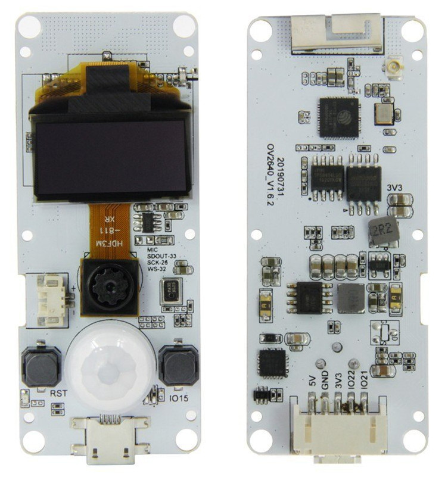                                                      |                         |        |        |       | OV2640          |             |                                                                                                                                   |
| M5Stack ESP32CAM                | 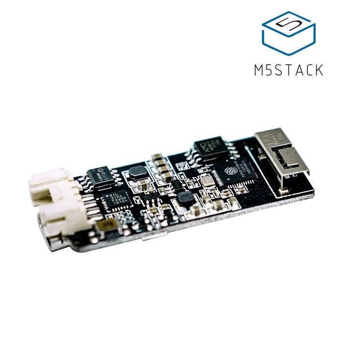                                                      | ESP32                   | 520KB  | 4MB    | -     | OV2640          | Microphone  | [https://docs.m5stack.com/en/unit/esp32cam](https://docs.m5stack.com/en/unit/esp32cam)                                            |
| M5Stack UnitCam                 | 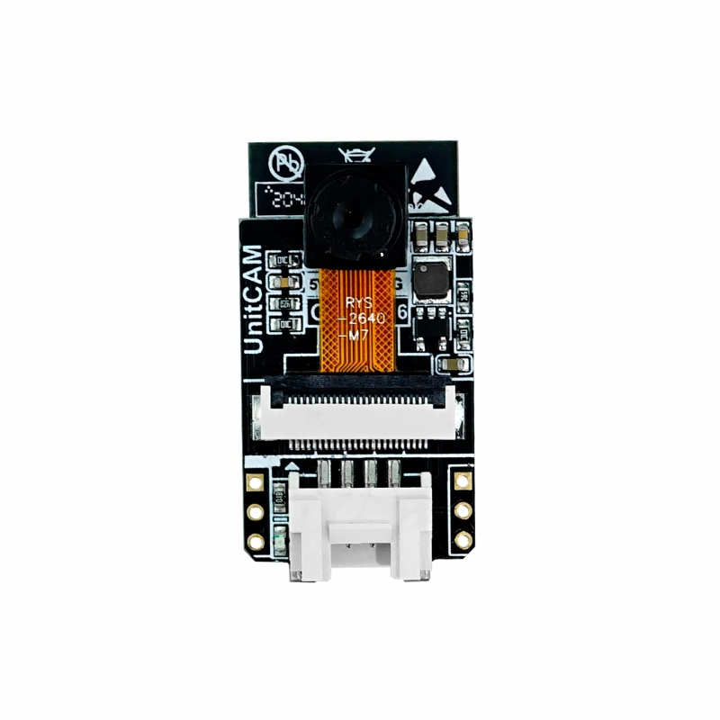 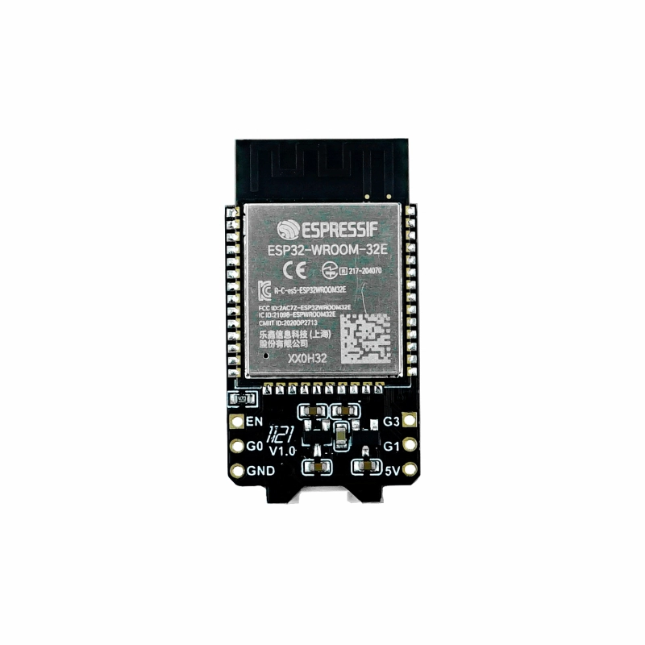       | ESP32-WROOM-32E         | 520KB  | 4MB    | -     | OV2640          |             | [https://docs.m5stack.com/en/unit/unit_cam](https://docs.m5stack.com/en/unit/unit_cam)                                            |
| M5Stack Camera                  | 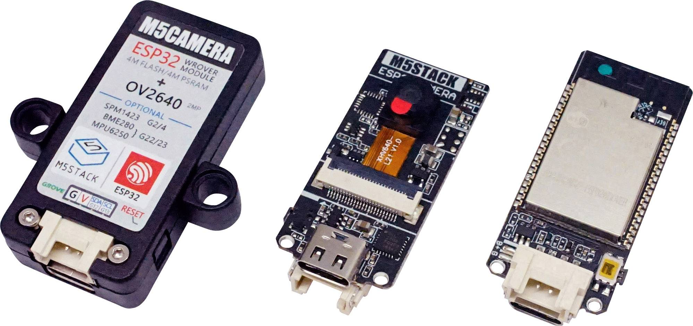                                                      | ESP32                   | 520KB  | 4MB    | -     | OV2640          |             | [https://docs.m5stack.com/en/unit/m5camera](https://docs.m5stack.com/en/unit/m5camera)                                            |
| M5Stack Camera PSRAM            |                                                       | ESP32                   | 520KB  | 4MB    | 4MB   | OV2640          |             | [https://docs.m5stack.com/en/unit/m5camera](https://docs.m5stack.com/en/unit/m5camera)                                            |
| M5Stack UnitCamS3               | 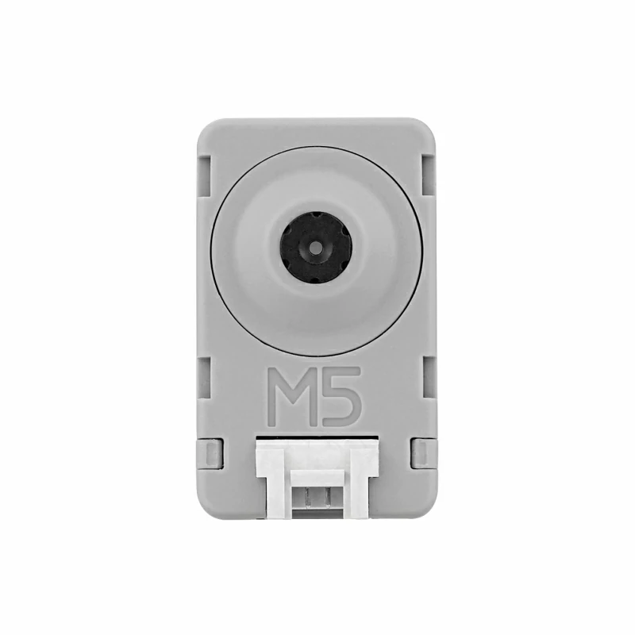 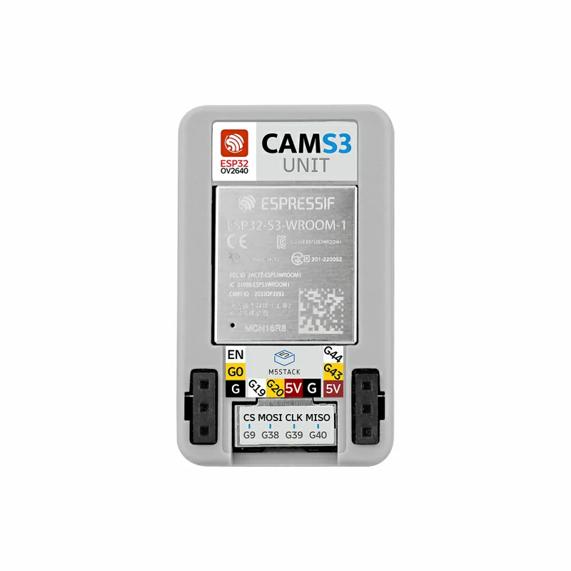         | ESP32-S3-WROOM-1-N16R8  | 520KB  | 16MB   | 8MB   | OV2640          |             | [https://docs.m5stack.com/en/unit/Unit-CamS3](https://docs.m5stack.com/en/unit/Unit-CamS3)                                        |
| Seeed Studio XIAO ESP32S3 Sense | 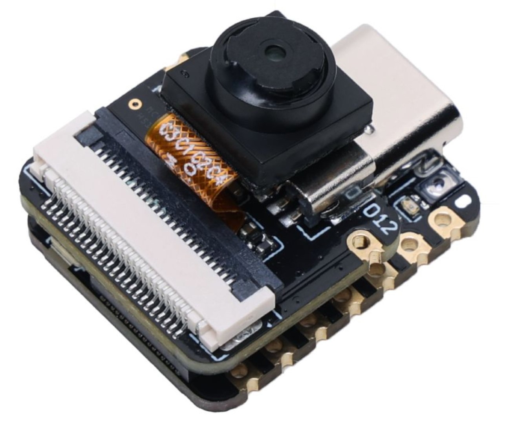                                           | ESP32-S3R8              | 520KB  | 8MB    | 8MB   | OV2640          | Microphone  | [https://www.seeedstudio.com/XIAO-ESP32S3-Sense-p-5639.html](https://www.seeedstudio.com/XIAO-ESP32S3-Sense-p-5639.html)          |

## Installing and running PlatformIO

PlatformIO is available for all major operating systems: Windows, Linux and MacOS. It is also provided as a plugin to [Visual Studio Code](https://visualstudio.microsoft.com).
More information can be found at: [https://docs.platformio.org/en/latest/installation.html](https://docs.platformio.org/en/latest/installation.html) below the basics.

Install [Visual Studio Code](https://code.visualstudio.com) and install the PlatformIO plugin.

## Putting the ESP32-CAM in download mode

### ESP32-CAM-MB

When using the ESP32-CAM-MB board, press and hold the GPIO0 button on the ESP32-CAM-MB board.
Then press short the reset button (on the inside) on the ESP32-CAM board and release the GPIO0 button.
This will put the ESP32-CAM board in download mode.

### FTDI adapter

When using an FTDI adapter, make sure the adapter is set to 3.3 volt before connecting. Use the wiring schema below.

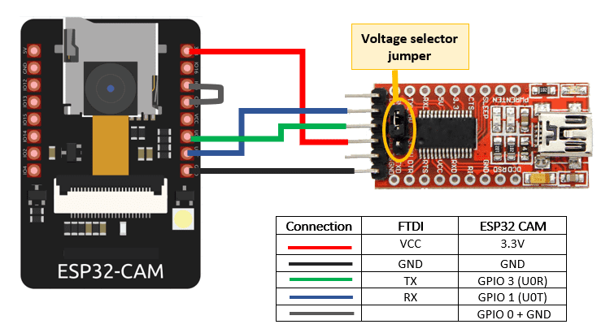

After programming remove the wire to the GPIO0 pin to exit the download mode.

## Compiling and deploying the software

Open a command line or terminal window and clone this repository from GitHub.

```sh
git clone https://github.com/rzeldent/esp32cam-rtsp.git
```

Go into the folder

```sh
cd esp32cam-rtsp
```

Next, the firmware has to be built and deployed to the ESP32.
There are two flavours to do this; using the command line or the graphical interface of Visual Studio Code.

### Using the command line

Make sure you have the latest version of the Espressif toolchain.

```sh
pio pkg update -g -p espressif32
```

First the source code has to be compiled to build all targets

```sh
pio run
```

If only a specific target is required, for example the ```esp32cam_ttgo_t_journal``` type:

```sh
pio run -e esp32cam_ttgo_t_journal
```

When finished, firmware has to be uploaded.
Make sure the ESP32-CAM is in download mode (see previous section) and type:

```sh
 pio run -t upload
```

or, again, for a specific target, for example ```esp32cam_ai_thinker```

```sh
pio run -t upload -e esp32cam_ai_thinker
```

When done remove the jumper when using a FTDI adapter or press the reset button on the ESP32-CAM.
To monitor the output, start a terminal using:

```sh
 pio device monitor
```

### Using Visual Studio Code

Open the project in Visual Studio Code with the PlatformIO extension installed. Run the following tasks using ```Terminal -> Run Task``` (or `Ctrl+Alt+T`). Make sure the ESP32-CAM is in download mode during uploads.

- **PlatformIO: Build (esp32cam)** — compiles the firmware
- **PlatformIO: Upload (esp32cam)** — uploads the firmware to the device
- **PlatformIO: Monitor (esp32cam)** — opens the serial monitor to view debug output

## Setting up the ESP32CAM-RTSP

After the programming of the ESP32, there is no configuration present. This needs to be added.
To connect initially to the device open the WiFi connections and select the WiFi network / access point called **ESP32CAM-RTSP**.
Initially there is no password present.

After connecting, the browser should automatically open the status page.
In case this does not happen automatically, connect to [http://192.168.4.1](http://192.168.4.1).
In case this does not happen automatically, connect to [http://192.168.4.1](http://192.168.4.1).
This page will display the current settings and status. On the bottom, there is a link to the config. Click on this link.

This link brings up the configuration screen when connecting for the first time.
This link brings up the configuration screen when connecting for the first time.

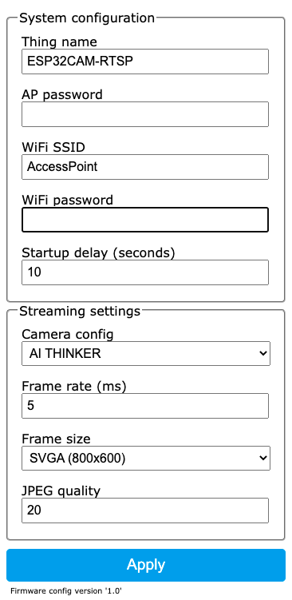

Configure at least:

- The access point to connect to. No dropdown is present to show available networks!
- A password for accessing the Access point (AP) when starting. (required)
- Type of the ESP32-CAM board

When finished press ```Apply``` to save the configuration. The screen will redirect to the status screen.
Here it is possible to reboot the device so the settings take effect.
It is also possible to restart manually by pressing the reset button.

## Connecting to the configuration

After the initial configuration and the device is connected to an access point, the device can be configured over http.

The device announces itself on the local network via mDNS as `esp32cam-rtsp-<mac>.local`, where `<mac>` is the device's MAC address (also shown on the status page). Connect to `http://esp32cam-rtsp-<mac>` — or to the device's IP address — to open the status screen.

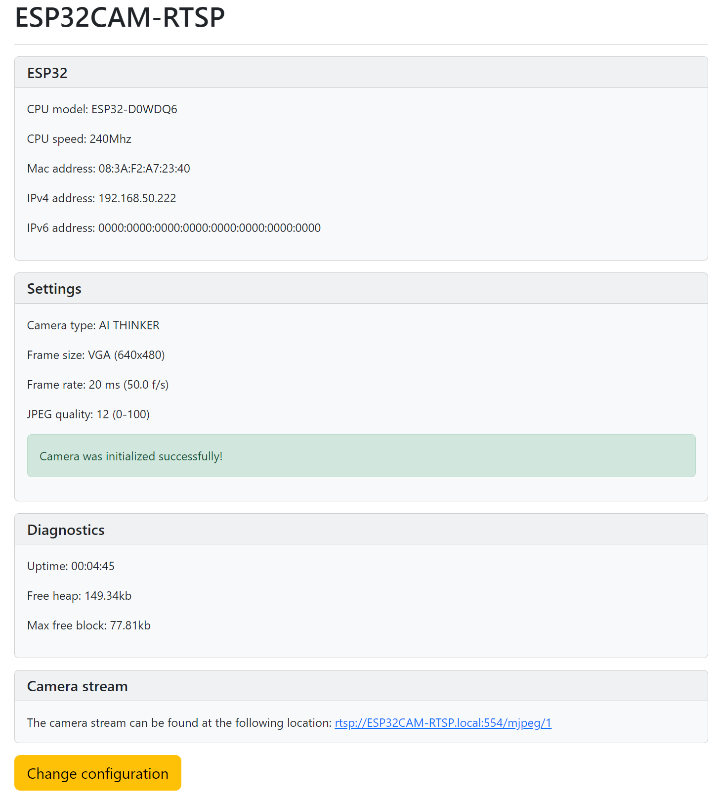

In case changes have been made to the configuration, this is shown and the possibility to restart is given.

Clicking on the ```change configuration``` button will open the configuration. It is possible that a password dialog is shown before entering.
If this happens, enter the RTSP username and password configured under ```RTSP settings```
(see [RTSP authentication](#rtsp-authentication)).

## Connecting to the RTSP stream

RTSP stream is available at `rtsp://esp32cam-rtsp-<mac>.local:554/mjpeg/1` (replace `<mac>` with the device's MAC address, or use its IP address).
This link can be opened with for example [VLC](https://www.videolan.org/vlc/).

### Transports

By default RTP is sent over UDP (the client announces its RTP ports in the `SETUP` request).
When the network filters or firewalls UDP traffic, force the RTP/RTSP/TCP (interleaved) transport in VLC:

```sh
vlc rtsp://esp32cam-rtsp-<mac>.local:554/mjpeg/1 --rtsp-tcp
```

### Secure RTP (SRTP)

The server can stream over Secure RTP (RFC 3711, crypto suite `AES_CM_128_HMAC_SHA1_80`).
SRTP encrypts the RTP payload with AES-128 in counter mode and authenticates every packet
with an HMAC-SHA1 tag, so the video cannot be watched or tampered with by someone sniffing
the network.

To enable it, build with the `MICRO_RTSP_ENABLE_SRTP` define, for example in `platformio.ini`:

```ini
build_flags =
  -DMICRO_RTSP_ENABLE_SRTP
```

The keys are negotiated per session with the `a=crypto` attribute (RFC 4568) that the server
advertises in its `DESCRIBE` and `SETUP` replies. A client that offers its own `a=crypto`
in the `SETUP` request enables SRTP for that session as well. Receive the stream with FFmpeg
(which picks up the `a=crypto` key automatically):

```sh
ffmpeg -rtsp_transport tcp -i rtsp://esp32cam-rtsp-<mac>.local:554/mjpeg/1 -c copy out.mp4
```

> [!NOTE]
> SRTP is intentionally **not** enabled by default: it requires an SRTP-capable client and
> breaks plain players such as VLC. The `a=crypto` negotiation is handled by
> `lib/micro-rtsp-server`.

#### Testing SRTP with `srtp_client.py`

The repository contains a small Python client, `tools/srtp_client.py`, that verifies the
SRTP stream end-to-end. It negotiates SRTP by offering its own `a=crypto` attribute
(RFC 4568) in the RTSP `SETUP` request, derives the session keys exactly like the firmware
(`lib/micro-rtsp-server/src/micro_rtsp_srtp.cpp`), decrypts the incoming RTP, reassembles
the JPEG frames (RFC 2435) and saves them to disk.

Requirements:

```sh
pip install cryptography
```

Usage:

```sh
python tools/srtp_client.py --host <ip address> [--port 554] [--rtp-port 50000]
    [--frames 5] [--time 10] [--out frames]
```

| Option        | Default | Description                                                       |
|---------------|---------|-------------------------------------------------------------------|
| `--host`      | —       | IP address (or mDNS name) of the camera (**required**)            |
| `--port`      | 554     | RTSP port                                                         |
| `--rtp-port`  | 50000   | Local UDP port to receive the RTP/SRTP stream                     |
| `--frames`    | 0       | Stop after N frames (0 = receive for `--time` seconds)            |
| `--time`      | 10.0    | Receive for this many seconds                                     |
| `--out`       | frames  | Output directory for the raw JPEG frames                          |

Example run:

```sh
python tools/srtp_client.py --host 192.168.1.149
```

```text
--- SDP ---
v=0
o=- 1085377743 1 IN IP4 192.168.1.149
s=
t=0 0
m=video 0 RTP/AVP 26
c=IN IP4 0.0.0.0
a=control:track1

--- SETUP response ---
a=crypto:1 AES_CM_128_HMAC_SHA1_80 inline:TUAwUoKwQs9G/qhlrmG5KnVyh/ZXLVUxtcGgabHB
Content-Type: application/sdp

server master key : 4d40305282b042cf46fea865ae61b92a
server master salt: 757287f6572d5531b5c1a069b1c1
Receiving SRTP on UDP 50000 ...
  frame 1: 3166 bytes -> frames\frame_0001.bin
  frame 2: 2770 bytes -> frames\frame_0002.bin
  frame 3: 3373 bytes -> frames\frame_0003.bin
  frame 4: 3373 bytes -> frames\frame_0004.bin
  frame 5: 3373 bytes -> frames\frame_0005.bin
```

> [!IMPORTANT]
> Do **not** enable **RTSP authentication** (basic auth) when using this tool. The client
> sends `OPTIONS`, `DESCRIBE`, `SETUP` and `PLAY` requests without credentials, so when
> basic auth is enabled the server rejects them and the SRTP session cannot be established.
> Leave the **username**/**password** under **RTSP settings** empty while testing with
> `srtp_client.py`.

### Audio

When the board has an onboard I2S microphone, an additional audio track is offered and streamed
together with the video as G.711 a-law (PCMA, 8 kHz mono). VLC plays it automatically.
Currently audio is enabled for the Seeed Studio XIAO ESP32S3 SENSE board (see `boards/` and the
`MIC_I2S_*` defines). To enable it on another board, add the microphone I2S pins to its board
configuration, for example:

```json
"'-D MIC_I2S_BCLK=17'",
"'-D MIC_I2S_WS=42'",
"'-D MIC_I2S_DIN=41'"
```

### ffmpeg

The stream can be recorded to disk, for example:

```sh
ffmpeg -rtsp_transport tcp -i rtsp://esp32cam-rtsp-<mac>.local:554/mjpeg/1 -c copy out.mp4
```

### Implementation

The RTSP server is implemented by the `micro-rtsp-server` library (in `lib/micro-rtsp-server`),
a small single-threaded server that supports multiple simultaneous clients, RTP/UDP and
RTP/RTSP/TCP transports, and (optionally) an audio track. The video frames are captured with
`esp32-camera`, decoded with the `micro-jpg` library to locate the JPEG quantization tables, and
packetized into RFC 2435 (JPEG over RTP) packets.

## RTSP authentication

The RTSP server supports **HTTP Basic authentication** (RFC 2617). When enabled, clients must
present the configured credentials before they can describe, set up or play the stream.

Authentication is **disabled by default**. To enable it, open the configuration page and set a
**username** and **password** under the **RTSP settings** group, then apply the configuration and
reboot.

When authentication is enabled:

- RTSP players such as [VLC](https://www.videolan.org/vlc/) prompt for the username and password
  when connecting to the stream:

  ```sh
  vlc rtsp://esp32cam-rtsp-<mac>.local:554/mjpeg/1
  ```

- The credentials can also be embedded in the URL:

  ```sh
  vlc rtsp://<username>:<password>@esp32cam-rtsp-<mac>.local:554/mjpeg/1
  ```

- `OPTIONS` requests remain open (unauthenticated) so clients and monitoring tools can still
  probe the endpoint without credentials.

The **same credentials** protect the configuration page at
`http://esp32cam-rtsp-<mac>.local/config` (HTTP Basic authentication, realm `ESP32CAM-RTSP`).
The `/snapshot` and `/stream` pages are not password protected.

## Connecting to the JPEG motion server

The JPEG motion server is available in a web browser at `http://esp32cam-rtsp-<mac>.local/stream` (replace `<mac>` with the device's MAC address).

## Connecting to the image server

The image server is available in a web browser at `http://esp32cam-rtsp-<mac>.local/snapshot`.

> [!WARNING]
> There is no password protection by default. Anyone with network access to the device can view the streams or images.

## API

There is a minimal API to perform tasks via HTTP requests. Some endpoints require **HTTP Basic Authentication**.

| Credential | Value                        |
|------------|------------------------------|
| Username   | Your configured RTSP username |
| Password   | Your configured RTSP password |

> Set the credentials under ```RTSP settings``` on the configuration page
> (see [RTSP authentication](#rtsp-authentication)). When no RTSP username is set,
> authentication is disabled. The credentials are cached in the browser session,
> so you only need to enter them once.

The available endpoints are:

### GET: /restart

Calling this URL will restart the device. Authentication is required.

### GET: /config

Calling this URL will start the form for configuring the device in the browser. Authentication is required.

### GET: /snapshot

Calling this URL will return a JPEG snapshot of the camera in the browser.
This request can also be used (for example using cURL) to save the snapshot to a file.

## Issues / Nice to know

- The red LED on the back of the device indicates the device is not connected.
- Sometimes after configuration a reboot is required.
  If the error screen is shown that it is unable to make a connection, first try to reboot the device,
- When booting, the device waits 30 seconds for a connection (configurable).
  You can make a connection to the SSID and log in using the credentials below,
- When connected, go to the ip of the device and, when prompted for the credentials, enter 'admin' and the AP password.
  This is a **required** field before saving the credentials,
- When the password is lost, a fix is to completely erase the ESP32 using the ```pio run -t erase``` command.
  This will reset the device including configuration.
  If using the esptool, you can do this using ```esptool.py --chip esp32 --port /dev/ttyUSB0 erase_flash```.
  However, after erasing, re-flashing of the firmware is required.
- When finished configuring for the first time and the access point is entered, disconnect from the wireless network provided by the device.
  This should reset the device and connect to the access point.
  Resetting is also a good alternative...
- There are modules that have no or faulty PSRAM (despite advertised as such).
  This can be the case if the camera fails to initialize.
  It might help to disable the use of the PSRAM and reduce the buffers and the screen size.

### Power

Make sure the power is 5 volts and stable, although the ESP32 is a 3.3V module, this voltage is created on the board.
If not stable, it has been reported that restarts occur when starting up (probably when power is required for WiFi).
The software disables the brown out protection so there is some margin in the voltage.
Some people suggest to add a capacitor over the 5V input to stabilize the voltage.

An unstable power supply is also the most common cause of **horizontal color stripes/bands
(blue, yellow or orange)** in the camera image. The OV2640 sensor is sensitive to supply noise
and voltage sag, which shows up as intermittent colored bands, often near the top or bottom
of the frame. If you see these stripes:

- power the board from a stable **5V/2A** supply on the **5V** pin (not the 3.3V pin),
- use short, thick wires,
- add a **100–470 µF** electrolytic capacitor across 5V and GND right at the board,
- avoid thin or long USB cables.

### PSRAM / Buffers / JPEG quality

Some esp32cam modules have additional ram on the board. This allows to use this ram as frame buffer.
The availability of PSRAM can be seen in the HTML status overview.

Not all the boards are equipped with PSRAM:

| Board              | PSRAM          |
|--------------------|----------------|
| WROVER_KIT         | 8MB            |
| ESP_EYE            | 8MB            |
| ESP32S3_EYE        | 8MB            |
| M5STACK_PSRAM      | 8MB            |
| M5STACK_V2_PSRAM   | Version B only |
| M5STACK_WIDE       | 8MB            |
| M5STACK_ESP32CAM   | No             |
| M5STACK_UNITCAM    | No             |
| M5STACK_UNITCAMS3  | 8MB            |
| M5STACK_M5PoECAM-W | 8MB            |
| AI_THINKER         | 4MB            |
| TTGO_T_JOURNAL     | No             |
| ESP32_CAM_BOARD    | ?              |
| ESP32S2_CAM_BOARD  | ?              |
| ESP32S3_CAM_LCD    | ?              |

Depending on the image resolution, framerate and quality, the PSRAM must be enabled and/or the number of frame buffers increased to keep up with the data generated by the sensor.
There are many boards around with faulty PSRAM. If the camera fails to initialize, this might be a reason — see this [Reddit post](https://www.reddit.com/r/esp32/comments/z2hyns/i_have_a_faulty_psram_on_my_esp32cam_what_should/).
In this case disable the use of PSRAM in the configuration and do not use camera modes that require PSRAM.

For the setting JPEG quality, a lower number means higher quality.
Be aware that a very high quality (low number) can cause the ESP32 cam to crash or return no image.

The default settings are:

- Frame size: **QVGA (320×240)**
- JPEG quality: **12** with PSRAM, **14** without PSRAM
- Frame buffers: **2**

### Camera module

Be careful when connecting the camera module.
Make sure it is connected the right way around (Camera pointing away from the board) and the ribbon cable inserted to the end before locking it.

### Image artifacts (color stripes / bands)

If the image shows horizontal color stripes or bands (e.g. blue, yellow or orange), the most likely causes are:

- **Power supply instability** (most common) — see [Power](#power) above.
- **Frame tearing** — reading a frame buffer while the camera is still writing it; keep at least 2 frame buffers.
- **Flickering artificial light** — the rolling shutter beats against LED/fluorescent flicker; test by covering the lens.
- **WiFi interference** — the antenna sits close to the camera; try lowering TX power or repositioning.

## Credits

esp32cam-rtsp depends on PlatformIO, IotWebConf, Bootstrap 5, micro-moustache and micro-timezonedb, plus the bundled `micro-rtsp-server` and `micro-jpg` libraries.

## Change history

- August 2026
  - Rewrote the RTSP server (`micro-rtsp-server`): RTP/UDP and RTP/RTSP/TCP, SRTP, G.711 audio
  - Improved streaming stability and performance
- August 2024
  - Added support for M5Stack M5PoECAM-W
- **January 2024**
  - Moved settings to board definitions
  - Added new boards
  - Removed OTA to increase performance
- October 2023
  - Added support for Seeed Xiao esp32s3
  - New build system
  - Updated documentation
- **March 2023**
  - Added options to set PSRAM / Frame buffers
  - Added JPEG Motion streaming
- **February 2023**
  - Added additional settings for camera configuration
- **November 2022**
  - Added OTA
  - Fix for grabbing frame
  - Fixed bug: Increased WiFi password length
- **September 2022**
  - Added GUI with Bootstrap
  - More information in web page
  - Added camera preview in HTML
- **July 2022**
  - Initial version